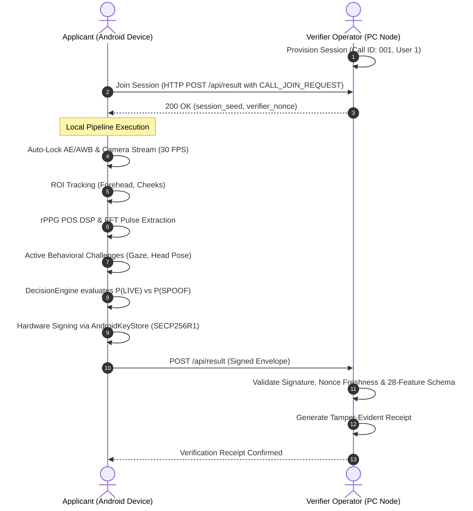

# EdgePPG End-to-End Walkthrough Guide

This walkthrough outlines how to execute, demonstrate, and test the **EdgePPG** on-device Video KYC (VKYC) verification gateway and spoof detection system.

---

## 1. System Overview

EdgePPG protects against presentation attacks (photos, video replays, screen displays) and deepfakes while preserving user privacy by running the entire biometric pipeline locally on the mobile device.



---

## 2. Running the Verification Flow

### A. Start the Verifier Server

1. Open PowerShell and navigate to the project directory:
   ```powershell
   cd E:\EdgePPG
   .\.venv\Scripts\python.exe -m verifier.server --port 8080
   ```
2. Open [http://127.0.0.1:8080/](http://127.0.0.1:8080/) in your browser.

### B. Launch & Connect the Mobile App

1. Install and launch the Android application:
   ```powershell
   cd E:\EdgePPG\android
   .\gradlew.bat assembleDebug
   adb install -r app\build\outputs\apk\debug\app-debug.apk
   ```
2. In the app:
   - Default **APPLICANT** is prefilled as `User1`.
   - Default **SESSION** is prefilled as `001`.
3. On the PC Dashboard:
   - Click **⚡ Autofill Sample** $\rightarrow$ Click **+ Schedule Session**.
4. In the mobile app:
   - Tap **`START / JOIN VERIFICATION ➔`**.

---

## 3. Testing Scenarios & Spoof Detection

| Test Case | Method | Expected Verdict | Why It Works |
| :--- | :--- | :--- | :--- |
| **Genuine Live Person** | Real face in front of camera | **`🛡️ VERIFIED LIVE APPLICANT`** | Blood volume pulse (BVP) creates synchronized microvascular phase shift across ROIs ($r \ge 0.35$). |
| **Printed Photo / Cutout** | Hold printed picture or paper to camera | **`⚠️ SYNTHETIC SPOOF DETECTED`** | No hemoglobin pulsation; spectral SNR $< 0.10$ and ROI agreement $\approx 0$. |
| **Screen / Phone Video Replay** | Play a video of a person on a screen | **`⚠️ SYNTHETIC SPOOF DETECTED`** | Display pixel refresh lacks human hemodynamics; rPPG POS heuristic flags low peak SNR and mismatched optical reflectance. |
| **Person Moving Naturally** | Live user with natural head motion / blinks | **`🛡️ VERIFIED LIVE APPLICANT`** | Peak-accumulated rPPG signal persists through motion; QualityGate prevents movement from masking physiological liveness. |

---

## 4. Verifier Dashboard Features

- **Live Verification Queue**: Displays scheduled, connected, and completed verification calls with short identifiers.
- **Decision & Audit Log**: Real-time ledger recording cryptographic attestations, decision verdicts (`LIVE`, `SPOOF`, `UNCERTAIN`), and receipt references.
- **28-Feature Telemetry Inspection**: Expandable technical inspector detailing the 28-feature schema (hemodynamic SNR, ROI correlation, gaze consistency, hardware attestation).
- **Test Lab Simulator**: Built-in test suite to benchmark attack types against the verifier rules.
